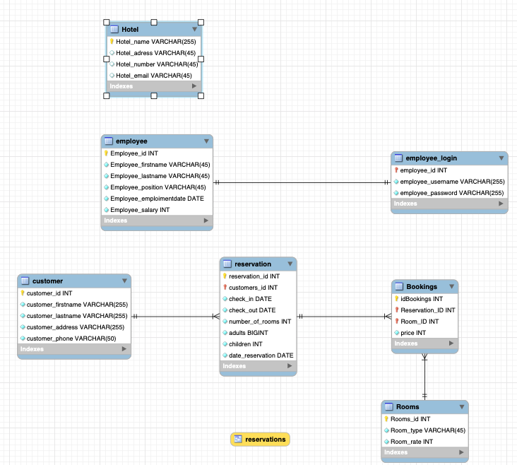

# Python-Project

We have designed and implemented a hotel management login portal for a fictional hotel.
In this login portal, said administrator can log in to manage the employee manifests 
primarily alongside the ability to delete reservations. The customers can make new 
reservations or view previously made ones using the Reservation ID The mock data we 
used for this was generated using this source: https://www.mockaroo.com/ due to the 
ease and speed this tool helped to create functional data. Further, there is the 
alternate option where a user can log in as a client to view their own reservations.

In order to run the application the user must have PyQt5 library installed and 
the run the "main.py" file.

The database .ibd files ware added in the hotelManagement folder

The Schema:
